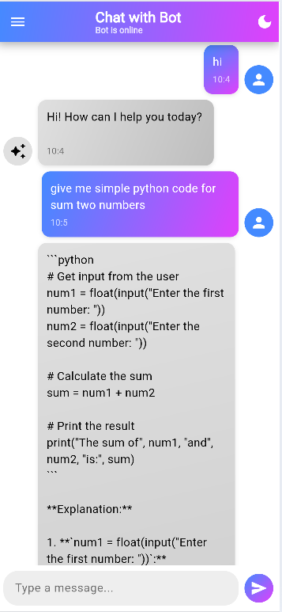
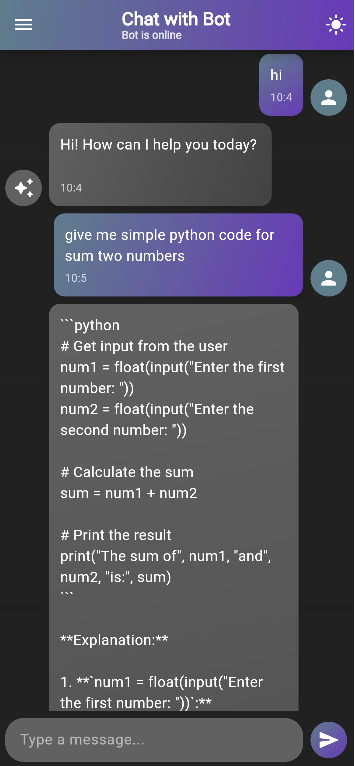
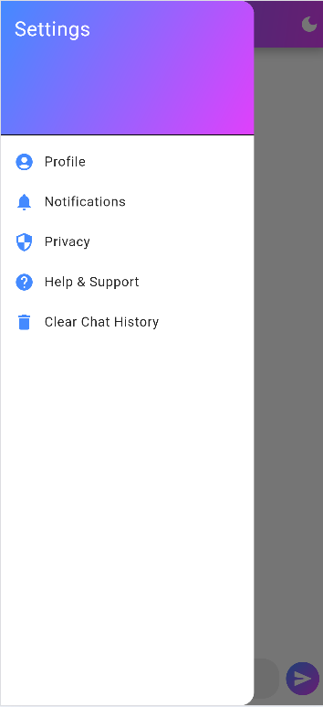

# Flutter Chatbot App 🤖

A Chatbot app built using Flutter that integrates with an AI model API. It supports text-based conversations, stores chat history, allows chat deletion, copying messages, and provides both dark and light mode options for a seamless user experience.

## Features ✨

- **🤖 AI Chatbot**: Communicate via text-based chat with an intelligent AI model.
- **📚 Chat History Storage**: Saves past conversations for easy reference.
- **🗑️ Delete Chat History**: Option to clear saved chats for privacy.
- **📋 Copy Chat Messages**: Easily copy any message to share or save.
- **🌙 Dark & Light Mode**: Toggle between themes for a better user experience.
- **🌐 AI Model API Integration**: Uses an AI API for generating chat responses.

## Screenshots 📸

Here are some screenshots of the app in action:

| **Chat & AI Respons** | **Dark Mode** | **Slide Panel** |
|----------------|---------------|------------------|
|  |  |  |


### Prerequisites 📋

- **Flutter SDK**: Ensure you have Flutter installed. If not, follow the [official installation guide](https://flutter.dev/docs/get-started/install).
- **Dart**: Comes bundled with Flutter SDK.
- **IDE**: Android Studio or VS Code with the Flutter and Dart plugins installed.
- **AI Model API Key**: Obtain an API key for the AI model you wish to use.

### Installation ⚙️

1. **Clone the repository**:
   ```bash
   git clone https://github.com/deshanjagoda/Chat_Bot_App.git
   cd Chat_Bot_App
